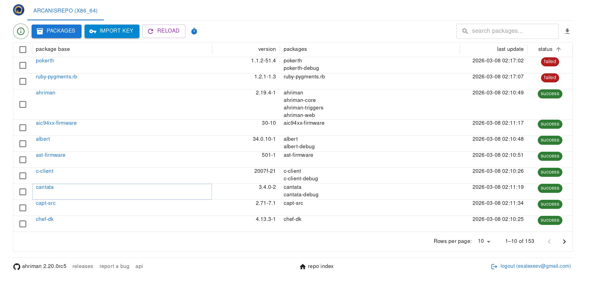

# ArcH linux ReposItory MANager

Wrapper for managing custom repository inspired by [repo-scripts](https://github.com/arcan1s/repo-scripts).

## Features

* Install-configure-forget manager for own repository.
* Multi-architecture support.
* VCS packages support.
* Sign support with gpg (repository, package, per package settings).
* Synchronization to remote services (rsync, s3 and github) and report generation (email, html, telegram).
* Dependency manager.
* Ability to patch AUR packages and even create package from local PKGBUILDs.
* Repository status interface with optional authorization and control options:

    

## Installation and run

For installation details please refer to the [documentation](docs/setup.md). For command help, `--help` subcommand must be used. Subcommands have own help message as well. The package also provides a [man page](docs/ahriman.1).

## Configuration

Every available option is described in the [documentation](docs/configuration.md).

## [FAQ](docs/faq.md)
