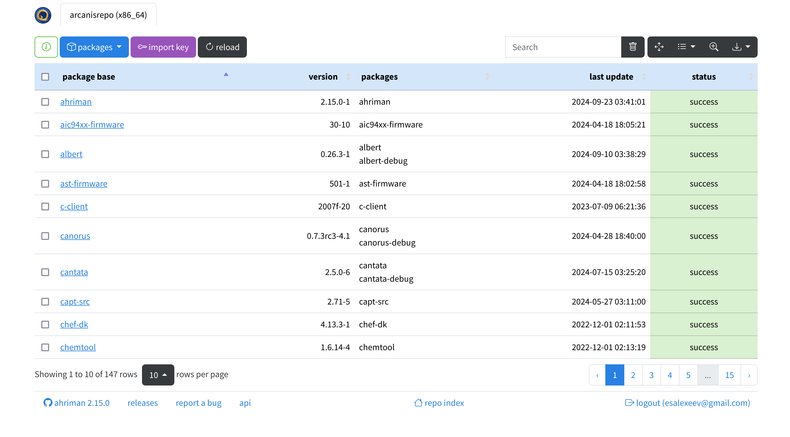

# ArcH linux ReposItory MANager

Wrapper for managing custom repository inspired by [repo-scripts](https://github.com/arcan1s/repo-scripts).

## Features

* Install-configure-forget manager for the very own repository.
* Multi-architecture support.
* Dependency manager.
* VCS packages support.
* Official repository support.
* Ability to patch AUR packages and even create package from local PKGBUILDs.
* Sign support with gpg (repository, package, per package settings).
* Triggers for repository updates, e.g. synchronization to remote services (rsync, s3 and github) and report generation (email, html, telegram).
* Repository status interface with optional authorization and control options:

    

## Installation and run

For installation details kindly refer to the [documentation](https://ahriman.readthedocs.io/en/latest/setup.html). For application commands it is possible to get information by using `--help`/`help` command or by using man page ([web version](https://ahriman.readthedocs.io/en/latest/command-line.html)).

## Configuration

Every available option is described in the [documentation](https://ahriman.readthedocs.io/en/latest/configuration.html).

The application provides reasonable defaults which allow to use it out-of-box, though additional steps (like configuring build toolchain and sudoers) is recommended and can be easily achieved by following install instructions.

## [FAQ](https://ahriman.readthedocs.io/en/latest/faq.html)
