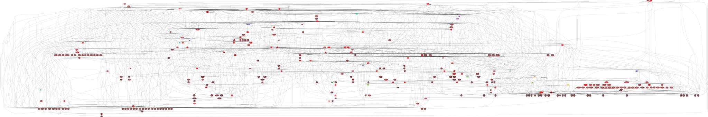

Architecture
============

Package structure
-----------------

Packages have strict rules of importing:

* ``ahriman.application`` package must not be used anywhere except for itself.
* ``ahriman.core`` and ``ahriman.models`` packages don't have any import restriction. Actually we would like to totally restrict importing of ``core`` package from ``models``, but it is impossible at the moment.
* ``ahriman.web`` package is allowed to be imported from ``ahriman.application`` (web handler only, only ``ahriman.web.web`` methods). It also must not be imported globally, only local import is allowed. 

Full dependency diagram:

``ahriman.application`` package
^^^^^^^^^^^^^^^^^^^^^^^^^^^^^^^

This package contains application (aka executable) related classes and everything for it. It also contains package called ``ahriman.application.handlers`` in which all available subcommands are described as separated classes derived from base ``ahriman.application.handlers.Handler`` class.

``ahriman.application.application.Application`` (god class) is used for any interaction from parsers with repository. It is divided into multiple traits by functions (package related and repository related) in the same package.

``ahriman.application.ahriman`` contains only command line parses and executes specified ``Handler`` on success, ``ahriman.application.lock.Lock`` is additional class which provides file-based lock and also performs some common checks.

``ahriman.core`` package
^^^^^^^^^^^^^^^^^^^^^^^^

This package contains everything required for the most of application actions and it is separated into several packages:

* ``ahriman.core.alpm`` package controls pacman related functions. It provides wrappers for ``pyalpm`` library and safe calls for repository tools (``repo-add`` and ``repo-remove``). Also this package contains ``ahriman.core.alpm.remote`` package which provides wrapper for remote sources (e.g. AUR RPC and official repositories RPC).
* ``ahriman.core.auth`` package provides classes for authorization methods used by web mostly. Base class is ``ahriman.core.auth.Auth`` which must be called by ``load`` method.
* ``ahriman.core.build_tools`` is a package which provides wrapper for ``devtools`` commands.
* ``ahriman.core.configuration`` contains extension for standard ``configparser`` library and some validation related classes.
* ``ahriman.core.database`` is everything including data and schema migrations for database.
* ``ahriman.core.formatters`` package provides ``Printer`` sub-classes for printing data (e.g. package properties) to stdout which are used by some handlers.
* ``ahriman.core.gitremote`` is a package with remote PKGBUILD triggers. Should not be called directly.
* ``ahriman.core.http`` package provides HTTP clients which can be later used by other classes.
* ``ahriman.core.log`` is a log utils package. It includes logger loader class, custom HTTP based logger and access logger for HTTP services with additional filters.
* ``ahriman.core.report`` is a package with reporting triggers. Should not be called directly.
* ``ahriman.core.repository`` contains several traits and base repository (``ahriman.core.repository.Repository`` class) implementation.
* ``ahriman.core.sign`` package provides sign feature (only gpg calls are available).
* ``ahriman.core.status`` contains helpers and watcher class which are required for web application. Reporter must be initialized by using ``ahriman.core.status.client.Client.load`` method.
* ``ahriman.core.support`` provides plugins for support packages (mirrorlist and keyring) generation.
* ``ahriman.core.triggers`` package contains base trigger classes. Classes from this package must be imported in order to implement user extensions. In fact, ``ahriman.core.report``, ``ahriman.core.upload`` and other built-in triggers use this package.
* ``ahriman.core.upload`` package provides sync feature, should not be called directly.

This package also provides some generic functions and classes which may be used by other packages:

* ``ahriman.core.exceptions`` provides custom exceptions.
* ``ahriman.core.spawn.Spawn`` is a tool which can spawn another ``ahriman`` process. This feature is used by web application.
* ``ahriman.core.tree`` is a dependency tree implementation.

``ahriman.models`` package
^^^^^^^^^^^^^^^^^^^^^^^^^^

It provides models for any other part of application. Unlike ``ahriman.core`` package classes from here provide only conversion methods (e.g. create class from another or convert to). It is mostly presented by case classes and enumerations.

``ahriman.web`` package
^^^^^^^^^^^^^^^^^^^^^^^

Web application. It is important that this package is isolated from any other to allow it to be optional feature (i.e. dependencies which are required by the package are optional).

* ``ahriman.web.middlewares`` provides middlewares for request handlers.
* ``ahriman.web.schemas`` provides schemas (actually copy paste from dataclasses) used by swagger documentation.
* ``ahriman.web.views`` contains web views derived from aiohttp view class.
* ``ahriman.web.apispec`` provides generators for swagger documentation.
* ``ahriman.web.cors`` contains helpers for cross origin resource sharing middlewares.
* ``ahriman.web.routes`` creates routes for web application.
* ``ahriman.web.web`` provides main web application functions (e.g. start, initialization).

Application run
---------------

#. Parse command line arguments, find subcommand and related handler which is set by the parser.
#. Call ``Handler.execute`` method.
#. Define list of architectures to run. In case if there is more than one architecture specified run several subprocesses or continue in current process otherwise. Class attribute ``ALLOW_MULTI_ARCHITECTURE_RUN`` controls whether the application can be run in multiple processes or not - this feature is required for some handlers (e.g. ``Web``, which should be able to spawn child process in daemon mode; it is impossible to do from daemonic processes).
#. In each child process call lock functions.
#. After success checks pass control to ``Handler.run`` method defined by specific handler class.
#. Return result (success or failure) of each subprocess and exit from application.
#. Some handlers may override their status and throw ``ExitCode`` exception. This exception is just silently suppressed and changes application exit code to ``1``.

In the most cases handlers spawn god class ``ahriman.application.application.Application`` class and call required methods.

The application is designed to run from ``systemd`` services and provides parametrized by repository identifier timer and service file for that.

Subcommand design
^^^^^^^^^^^^^^^^^

All subcommands are divided into several groups depending on the role they are doing:

* ``aur`` (``aur-search``) group is for AUR operations.
* ``help`` (e.g. ``help``) are system commands.
* ``package`` subcommands (e.g. ``package-add``) allow to perform single package actions.
* ``patch`` subcommands (e.g. ``pacth-list``) are the special case of ``package`` subcommands introduced in order to control patches for packages.
* ``repo`` subcommands (e.g. ``repo-check``) usually perform actions on whole repository.
* ``service`` subcommands (e.g. ``service-setup``) perform actions which are related to whole service managing: create repository, show configuration.
* ``user`` subcommands (``user-add``) are intended for user management.
* ``web`` subcommands are related to web service management.

For historical reasons and in order to keep backward compatibility some subcommands have aliases to their shorter forms or even other groups, but the application doesn't guarantee that they will remain unchanged.

Filesystem tree
---------------

The application supports two types of trees, one is for the legacy configuration (when there were no repository name explicit configuration available) and another one is the new-style tree. This document describes only new-style tree in order to avoid deprecated structures.

Having default root as ``/var/lib/ahriman`` (differs from container though), the directory structure is the following:

.. code-block::

   /var/lib/ahriman/
   ├── ahriman.db
   ├── cache
   ├── chroot
   │   └── aur-clone
   ├── packages
   │   └── aur-clone
   │       └── x86_64
   ├── pacman
   │   └── aur-clone
   │       └── x86_64
   │           ├── local
   │           │   └── ALPM_DB_VERSION
   │           └── sync
   │               ├── core.db
   │               ├── extra.db
   │               └── multilib.db
   │
   └── repository
       └── aur-clone
           └── x86_64
               ├── aur-clone.db -> aur-clone.db.tar.gz
               ├── aur-clone.db.tar.gz
               ├── aur-clone.files -> aur-clone.files.tar.gz
               └── aur-clone.files.tar.gz

There are multiple subdirectories, some of them are commons for any repository, but some of them are not.

* ``cache`` is a directory with locally stored PKGBUILD's and VCS packages. It is common for all repositories and architectures.
* ``chroot/{repository}`` is a chroot directory for ``devtools``. It is specific for each repository, but shared for different architectures inside (the ``devtools`` handles architectures automatically).
* ``packages/{repository}/{architecture}`` is a directory with prebuilt packages. When package is built, first it will be uploaded to this directory and later will be handled by update process. It is architecture and repository specific.
* ``pacman/{repository}/{architecture}`` is the repository and architecture specific caches for pacman's databases.
* ``repository/{repository}/{architecture}`` is a repository packages directory.

Normally you should avoid direct interaction with the application tree. For tree migration process refer to the :doc:`migration notes <migration>`.

Database
--------

The service uses SQLite database in order to store some internal info.

Database instance
^^^^^^^^^^^^^^^^^

All methods related to specific part of database (basically operations per table) are split into different traits located inside ``ahriman.core.database.operations`` package. The base trait ``ahriman.core.database.operations.Operations`` also provides generic methods for database access (e.g. row converters and transactional support).

The ``ahriman.core.database.SQLite`` class itself derives from all of these traits and implements methods for initialization, including migrations.

Schema and data migrations
^^^^^^^^^^^^^^^^^^^^^^^^^^

The schema migration are applied according to current ``pragma user_info`` values, located at ``ahriman.core.database.migrations`` package and named as ``m000_migration_name.py`` (the preceding ``m`` is required in order to import migration content for tests). Additional class ``ahriman.core.database.migrations.Migrations`` reads all migrations automatically and applies them in alphabetical order.

These migrations can also contain data migrations. Though the recommended way is to migrate data directly from SQL requests, sometimes it is required to have external data (like packages list) in order to set correct data. To do so, special method ``migrate_data`` is used.

Type conversions
^^^^^^^^^^^^^^^^

By default, it parses rows into python dictionary. In addition, the following pseudo-types are supported:

* ``dict[str, Any]``, ``list[Any]`` - for storing JSON data structures in database (technically there is no restriction on types for dictionary keys and values, but it is recommended to use only string keys). The type is stored as ``json`` data type and ``json.loads`` and ``json.dumps`` methods are used in order to read and write from/to database respectively.

Basic flows
-----------

By default package build operations are performed with ``PACKAGER`` which is specified in ``makepkg.conf``, however, it is possible to override this variable from command line; in this case service performs lookup in the following way:

* If packager is not set, it reads environment variables (e.g. ``SUDO_USER`` and ``USER``), otherwise it uses value from command line.
* It checks users for the specified username and tries to extract packager variable from it.
* If packager value has been found, it will be passed as ``PACKAGER`` system variable (sudo configuration required).

Add new packages or rebuild existing
^^^^^^^^^^^^^^^^^^^^^^^^^^^^^^^^^^^^

Idea is to copy package to the directory from which it will be handled at the next update run. Different variants are supported:

* If supplied argument is file then application moves the file to the directory with built packages. Same rule applies for directory, but in this case it copies every package-like file from the specified directory.
* If supplied argument is directory and there is ``PKGBUILD`` file there it will be treated as local package. In this case it will queue this package to build and copy source files (``PKGBUILD`` and ``.SRCINFO``) to caches.
* If supplied argument is not file then application tries to lookup for the specified name in AUR and clones it into the directory with manual updates. This scenario can also handle package dependencies which are missing in repositories.

This logic can be overwritten by specifying the ``source`` parameter, which is partially useful if you would like to add package from AUR, but there is local directory cloned from AUR. Also official repositories calls are hidden behind explicit source definition.

Rebuild packages
^^^^^^^^^^^^^^^^

Same as add function for every package in repository. Optional filters by reverse dependency or build status can be supplied.

Remove packages
^^^^^^^^^^^^^^^

This flow removes package from filesystem, updates repository database and also runs synchronization and reporting methods.

Update packages
^^^^^^^^^^^^^^^

This feature is divided into to stages: check AUR for updates and run rebuild for required packages. Whereas check does not do anything except for check itself, update flow is the following:

#. Process every built package first. Those packages are usually added manually.
#. Run sync and report methods.
#. Generate dependency tree for packages to be built.
#. For each level of tree it does:

   #. Download package data from AUR.
   #. Bump ``pkgrel`` if there is duplicate version in the local repository (see explanation below).
   #. Build every package in clean chroot.
   #. Sign packages if required.
   #. Add packages to database and sign database if required.
   #. Process triggers.

After any step any package data is being removed.

pkgrel bump rules
^^^^^^^^^^^^^^^^^

The application is able to automatically bump package release (``pkgrel``) during build process if there is duplicate version in repository. The version will be incremented as following:

#. Get version of the remote package.
#. Get version of the local package if any.
#. If local version is not set, proceed with remote one.
#. If local version is set and epoch or package version (``pkgver``) are different, proceed with remote version.
#. If local version is set and remote version is newer than local one, proceed with remote.
#. Extract ``pkgrel`` value.
#. If it has ``major.minor`` notation (e.g. ``1.1``), then increment last part by 1, e.g. ``1.1 -> 1.2``, ``1.0.1 -> 1.0.2``.
#. If ``pkgrel`` is a number (e.g. ``1``), then append 1 to the end of the string, e.g. ``1 -> 1.1``.

Core functions reference
------------------------

Configuration
^^^^^^^^^^^^^

``ahriman.core.configuration.Configuration`` class provides some additional methods (e.g. ``getpath`` and ``getlist``) and also combines multiple files into single configuration dictionary using repository identifier overrides. It is the recommended way to deal with settings.

Enumerations
^^^^^^^^^^^^

All enumerations are derived from ``str`` and ``enum.Enum``. Integer enumerations in general are not allowed, because most of operations require conversions from string variable. Derivation from string class is required to make json conversions implicitly (e.g. during calling ``json.dumps`` methods).

In addition, some enumerations provide ``from_option`` class methods in order to allow some flexibility while reading configuration options.

Utils
^^^^^

For every external command run (which is actually not recommended if possible) custom wrapper for ``subprocess`` is used. Additional functions ``ahriman.core.auth.helpers`` provide safe calls for ``aiohttp_security`` methods and are required to make this dependency optional.

Context variables
^^^^^^^^^^^^^^^^^

Package provides implicit global variables which can be accessed from ``ahriman.core`` package as ``context`` variable, wrapped by ``contextvars.ContextVar`` class. The value of the variable is defaulting to private ``_Context`` class which is defined in the same module. The default values - such as ``database`` and ``sign`` - are being set on the service initialization.

The ``_Context`` class itself mimics default collection interface (as is ``Mapping``) and can be modified by ``_Context.set`` method. The stored variables can be achieved by ``_Context.get`` method, which is unlike default ``Mapping`` interface also performs type and presence checks.

In order to provide statically typed interface, the ``ahriman.models.context_key.ContextKey`` class is used for both ``_Content.get`` and ``_Content.set`` methods; the context instance itself, however, does not store information about types.

Submodules
^^^^^^^^^^

Some packages provide different behaviour depending on configuration settings. In these cases inheritance is used and recommended way to deal with them is to call class method ``load`` from base classes.

Authorization
^^^^^^^^^^^^^

The package provides several authorization methods: disabled, based on configuration and OAuth2. 

Disabled (default) authorization provider just allows everything for everyone and does not have any specific configuration (it uses some default configuration parameters though). It also provides generic interface for derived classes.

Mapping (aka configuration) provider uses hashed passwords with optional salt from the database in order to authenticate users. This provider also enables user permission checking (read/write) (authorization). Thus, it defines the following methods:

* ``check_credentials`` - user password validation (authentication).
* ``verify_access`` - user permission validation (authorization).

Passwords must be stored in database as ``hash(password + salt)``, where ``password`` is user defined password (taken from user input), ``salt`` is random string (any length) defined globally in configuration and ``hash`` is secure hash function. Thus, the following configuration

.. code-block::

   "username","password","access"
   "username","$6$rounds=656000$mWBiecMPrHAL1VgX$oU4Y5HH8HzlvMaxwkNEJjK13ozElyU1wAHBoO/WW5dAaE4YEfnB0X3FxbynKMl4FBdC3Ovap0jINz4LPkNADg0","read"

means that there is user ``username`` with ``read`` access and password ``password`` hashed by ``sha512`` with salt ``salt``.

OAuth provider uses library definitions (``aioauth-client``) in order *authenticate* users. It still requires user permission to be set in database, thus it inherits mapping provider without any changes. Whereas we could override ``check_credentials`` (authentication method) by something custom, OAuth flow is a bit more complex than just forward request, thus we have to implement the flow in login form.

OAuth's implementation also allows authenticating users via username + password (in the same way as mapping does) though it is not recommended for end-users and password must be left blank. In particular this feature can be used by service reporting (aka robots).

In addition, web service checks the source socket used. In case if it belongs to ``socket.AF_UNIX`` family, it will skip any further checks considering the request to be performed in safe environment (e.g. on the same physical machine). This feature, in particular is being used by the reporter instances in case if socket address is set in configuration.

In order to configure users there are special subcommands.

Triggers
^^^^^^^^

Triggers are extensions which can be used in order to perform any actions on application start, after the update process and, finally, before the application exit.

The main idea is to load classes by their full path (e.g. ``ahriman.core.upload.UploadTrigger``) by using ``importlib``: get the last part of the import and treat it as class name, join remain part by ``.`` and interpret as module path, import module and extract attribute from it.

The loaded triggers will be called with ``ahriman.models.result.Result`` and ``list[Packages]`` arguments, which describes the process result and current repository packages respectively. Any exception raised will be suppressed and will generate an exception message in logs.

In addition triggers can implement ``on_start`` and ``on_stop`` actions which will be called on the application start and right before the application exit respectively. The ``on_start`` action is usually being called from handlers directly in order to make sure that no trigger will be run when it is not required (e.g. on user management). As soon as ``on_start`` action is called, the additional flag will be set; ``ahriman.core.triggers.TriggerLoader`` class implements ``__del__`` method in which, if the flag is set, the ``on_stop`` actions will be called.

For more details how to deal with the triggers, refer to :doc:`documentation <triggers>` and modules descriptions.

Remote synchronization
^^^^^^^^^^^^^^^^^^^^^^

There are several supported synchronization providers, currently they are ``rsync``, ``s3``, ``github``.

``rsync`` provider does not have any specific logic except for running external rsync application with configured arguments. The service does not handle SSH configuration, thus it has to be configured before running application manually.

``s3`` provider uses ``boto3`` package and implements sync feature. The files are stored in architecture directory (e.g. if bucket is ``repository``, packages will be stored in ``repository/aur-clone/x86_64`` for the ``aur-clone`` repository ``x86_64`` architecture), bucket must be created before any action and API key must have permissions to write to the bucket. No external configuration required. In order to upload only changed files the service compares calculated hashes with the Amazon ETags, used realization is described `here <https://teppen.io/2018/10/23/aws_s3_verify_etags/>`_.

``github`` provider authenticates through basic auth, API key with repository write permissions is required. There will be created a release with the name of the architecture in case if it does not exist; files will be uploaded to the release assets. It also stores array of files and their MD5 checksums in release body in order to upload only changed ones. According to the Github API in case if there is already uploaded asset with the same name (e.g. database files), asset will be removed first.

Additional features
^^^^^^^^^^^^^^^^^^^

Some features require optional dependencies to be installed:

* Version control executables (e.g. ``git``, ``svn``) for VCS packages.
* ``gnupg`` application for package and repository sign feature.
* ``rsync`` application for rsync based repository sync.
* ``boto3`` python package for ``S3`` sync.
* ``Jinja2`` python package for HTML report generation (it is also used by web application).

Web application
---------------

Web application requires the following python packages to be installed:

* Core part requires ``aiohttp`` (application itself), ``aiohttp_jinja2`` and ``Jinja2`` (HTML generation from templates).
* Additional web features also require ``aiohttp-apispec`` (autogenerated documentation), ``aiohttp_cors`` (CORS support, required by documentation)
* In addition, ``aiohttp_debugtoolbar`` is required for debug panel. Please note that this option does not work together with authorization and basically must not be used in production.
* In addition, authorization feature requires ``aiohttp_security``, ``aiohttp_session`` and ``cryptography``.
* In addition to base authorization dependencies, OAuth2 also requires ``aioauth-client`` library.
* In addition if you would like to disable authorization for local access (recommended way in order to run the application itself with reporting support), the ``requests-unixsocket`` library is required.

Middlewares
^^^^^^^^^^^

Service provides some custom middlewares, e.g. logging every exception (except for user ones) and user authorization.

HEAD and OPTIONS requests
^^^^^^^^^^^^^^^^^^^^^^^^^

``HEAD`` request is automatically generated by ``ahriman.web.views.base.BaseView`` class. It just calls ``GET`` method, removes any data from body and returns the result. In case if no ``GET`` method available for this view, the ``aiohttp.web.HTTPMethodNotAllowed`` exception will be raised.

On the other side, ``OPTIONS`` method is implemented in the ``ahriman.web.middlewares.exception_handler.exception_handler`` middleware. In case if ``aiohttp.web.HTTPMethodNotAllowed`` exception is raised and original method was ``OPTIONS``, the middleware handles it, converts to valid request and returns response to user.

Web views
^^^^^^^^^

All web views are defined in separated package and derived from ``ahriman.web.views.base.Base`` class which provides typed interfaces for web application. 

REST API supports both form and JSON data, but the last one is recommended. 

Different APIs are separated into different packages:

* ``ahriman.web.views.api`` not a real API, but some views which provide OpenAPI support.
* ``ahriman.web.views.*.service`` provides views for application controls.
* ``ahriman.web.views.*.status`` package provides REST API for application reporting.
* ``ahriman.web.views.*.user`` package provides login and logout methods which can be called without authorization.

The views are also divided by supporting API versions (e.g. ``v1``, ``v2``).

Templating
^^^^^^^^^^

Package provides base jinja templates which can be overridden by settings. Vanilla templates are actively using bootstrap library.

Requests and scopes
^^^^^^^^^^^^^^^^^^^

Service provides optional authorization which can be turned on in settings. In order to control user access there are two levels of authorization - read-only (only GET-like requests) and write (anything) which are provided by each web view directly.

If this feature is configured any request will be prohibited without authentication. In addition, configuration flag ``auth.allow_read_only`` can be used in order to allow read-only operations - reading index page and packages - without authorization.

For authenticated users it uses encrypted session cookies to store tokens; encryption key is generated each time at the start of the application. It also stores expiration time of the session inside.

External calls
^^^^^^^^^^^^^^

Web application provides external calls to control main service. It spawns child process with specific arguments and waits for its termination. This feature must be used either with authorization or in safe (i.e. when status page is not available world-wide) environment.

For most actions it also extracts user from authentication (if provided) and passes it to underlying process.
